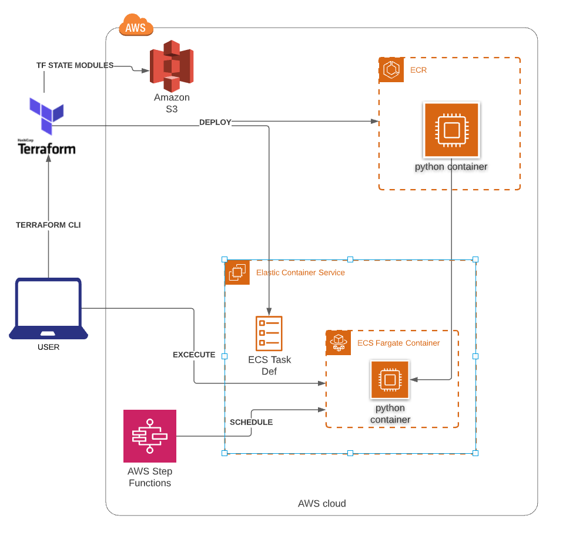
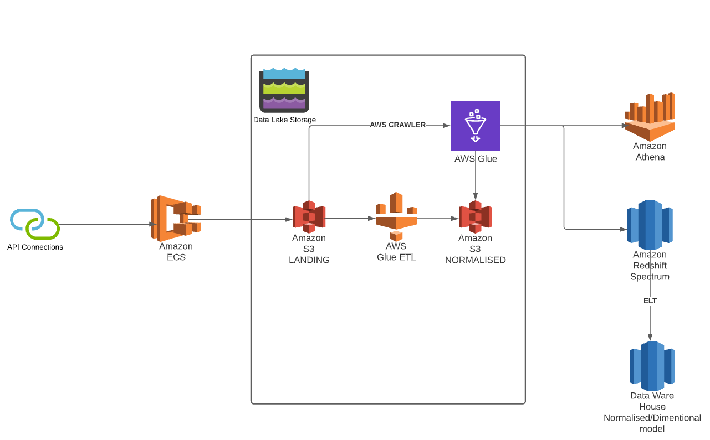

Webpage Visitor Data Analytics - Python ECS task
===

### Overview

To ingest events to datalake, create a data model and analyse the user page activities.
create visitor session analytics.

### Architecture



### Proposed Data flow Architecture



### How to set this project up for development
1. Ensure Python 3.7 is already setup.
2. Use virtualenv to create a virtual environment and pip install the requirements.txt file.
```shell
python -m venv .
source bin/activate
pip install -r requirements.txt
```

### How to deploy the Terraform and Docker image locally
1. Navigate to the Terraform folder.
2. `tfenv install` to install the required version of Terraform.
3. `tfenv use` to use the required version of Terraform.
4. `terraform init --var-file ./live/variables.tfvars --backend-config ./live/backend.conf` to initialize the project.
5. `terraform plan --var-file ./live/variables.tfvars` to view a plan.
6. `terraform apply --var-file ./live/variables.tfvars` to apply changes.
7. After ensuring the ECR repository was created using Terraform, you can upload the Docker image using the `build-and-push.sh script`.

### To run db container locally 
1. create folder /d/data/postgres_data/ to retain postgress sql data
2. below commands to run postgress locally. 
```shell
docker pull postgress
docker run -d --name dw_dev -e POSTGRES_PASSWORD=dbadmin -v ${HOME}/postgres-data/:/d/data/postgres_data/ -p 5432:5432 postgres
```

### To run python container locally
docker build -t python-ecs-task ..
docker run python-ecs-task